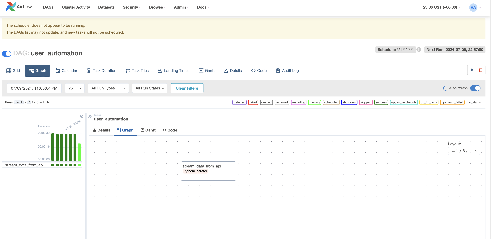
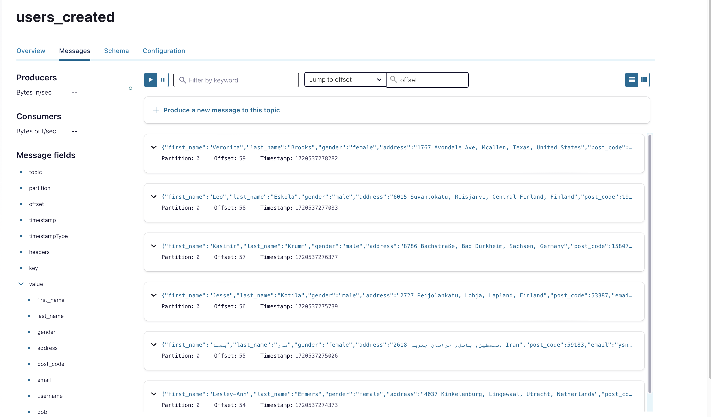
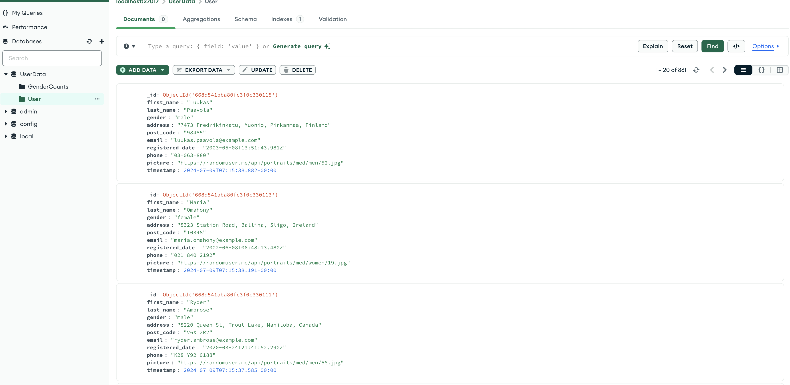
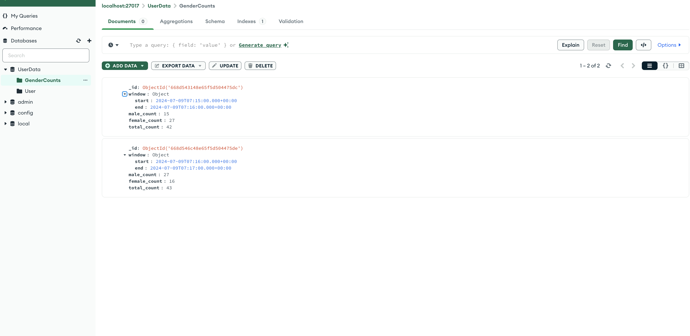

# Realtime-Data-Streaming
In this data engineering project, system architecture was implemented using Python, Random Name API, Airflow, Kafka, Spark and MongoDB. By seamlessly integrating these technologies, I have created a comprehensive data engineering solution that can handle large-scale data processing, real-time data ingestion, and long-term data storage.

## System Architecture

Overview:
- **Data Fetching and Orchestration**: 
    A Random Name API integration is leveraged to fetch data for processing, which is then orchestrated via Apache Airflow
- **Real-Time Data Ingestion and Communication**: 
    Kafka serves as a streaming platform, ingesting data and facilitating communication between pipeline components, ensuring seamless data flow and real-time processing.
- **Persistent Data Storage**: 
    MongoDB acts as a persistent data store for personal information, allowing for later analysis and retrieval of critical data.

## What I Learned
- Setting up a data pipeline with Apache Airflow
- Real-time data streaming with Apache Kafka
- Data processing techniques with Apache Spark
    - Stateful streaming
    - Stateless streaming
- Data storage solutions with MongoDB
- Containerizing your entire data engineering setup with Docker

## Getting Started
1. Clone the repository:
    ```bash
    git clone https://github.com/HsiuChuanHsu/Realtime-Data-Streaming.git
    ```
2. Navigate to the project directory:
    ```bash
    cd Realtime-Data-Streaming
    ```
3. Run Docker Compose
    ```bash
    docker-compose up -d
    ```
4. Install Python dependency management and package Poetry
- for mac
    ```bash
    brew install poetry
    # or 
    curl -sSL https://install.python-poetry.org | python3 -
    ```

- for windows
    ```bash
    $ (Invoke-WebRequest -Uri https://install.python-poetry.org -UseBasicParsing).Content | py -
    ```

### Airflow
---
When the Airflow DAG is run, the 'stream_data_from_api' task will be executed, and the 'stream_data()' function will be called. This will result in the Random Name API being called every minute, and the retrieved data will be sent to the Kafka topic 'users_created' during the first 30 seconds of each minute.


To view the Airflow web UI, you can access http://localhost:8080 in your web browser.

### Kafka
---
The Airflow DAG runs every minute and calls the stream_data() function, which retrieves data from the Random Name API and publishes it to the Kafka topic 'users_created'.
The Spark Streaming application consumes the data from the 'users_created' Kafka topic and processes it using Spark SQL. The processed data is then written to a MongoDB database.


http://localhost:9021/


### Spark Steeaming
---
- **Stateless Streaming**
    The Spark Streaming application continuously consumes the data from the 'users_created' Kafka topic and writes it to the MongoDB database, specifically the "UserData" database and the "User" collection.
    

- **Stateful Streaming**
    - Gender Count Aggregation
        - Groups the data by a 1-minute window using the window function.
        - Counts the number of males and females within each window using the when and count functions.
        - Calculates the total count for each window.
    - Write data to MongoDB
        The Spark Streaming application continuously consumes the data from the 'users_created' Kafka topic and writes it to the MongoDB database, specifically the "UserData" database and the "GenderCounts" collection.

    

