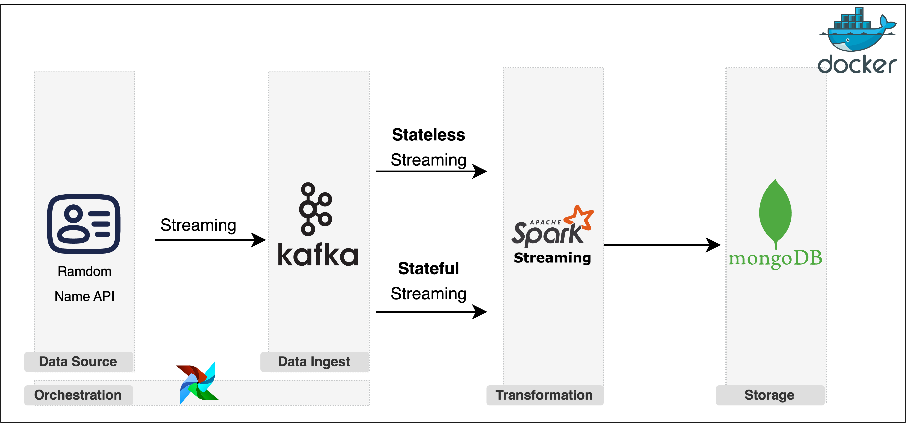

# Realtime-Data-Streaming
In this data engineering project, system architecture was implemented using Python, Random Name API, Airflow, Kafka, Spark and MongoDB. By seamlessly integrating these technologies, I have created a comprehensive data engineering solution that can handle large-scale data processing, real-time data ingestion, and long-term data storage.

## System Architecture

Overview:
- Data Fetching and Orchestration: 
    A Random Name API integration is leveraged to fetch data for processing, which is then orchestrated via Apache Airflow
- Real-Time Data Ingestion and Communication: 
    Kafka serves as a streaming platform, ingesting data and facilitating communication between pipeline components, ensuring seamless data flow and real-time processing.
- Persistent Data Storage: 
    MongoDB acts as a persistent data store for personal information, allowing for later analysis and retrieval of critical data.

## What I Learned
- Setting up a data pipeline with Apache Airflow
- Real-time data streaming with Apache Kafka
- Data processing techniques with Apache Spark
    - Stateful streaming
    - Stateless streaming
- Data storage solutions with MongoDB
- Containerizing your entire data engineering setup with Docker

### Airflow

### Kafka

### Spark

### MongoDB

